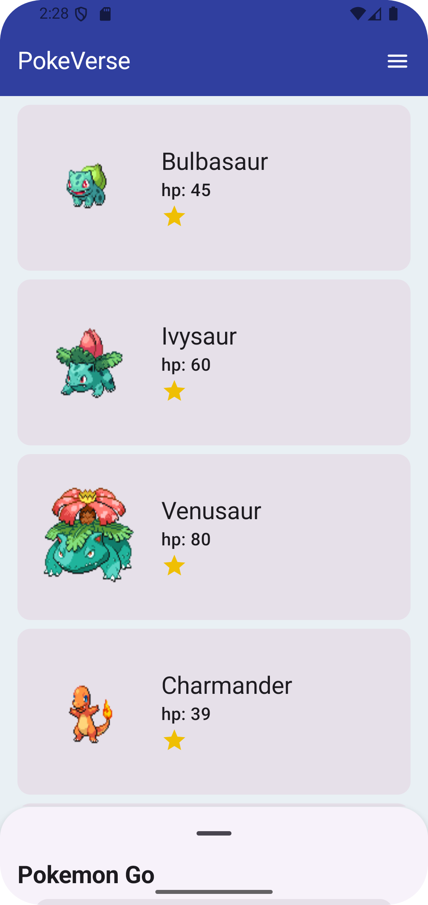
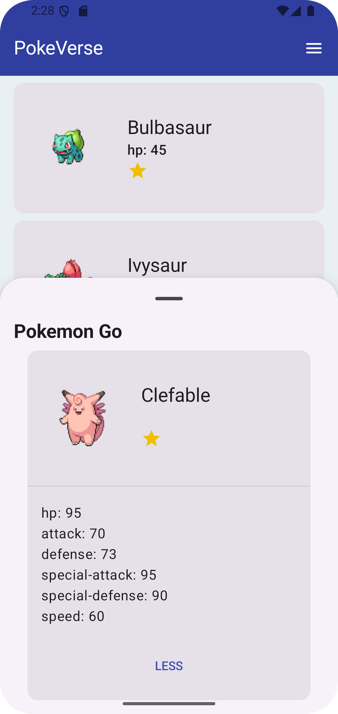
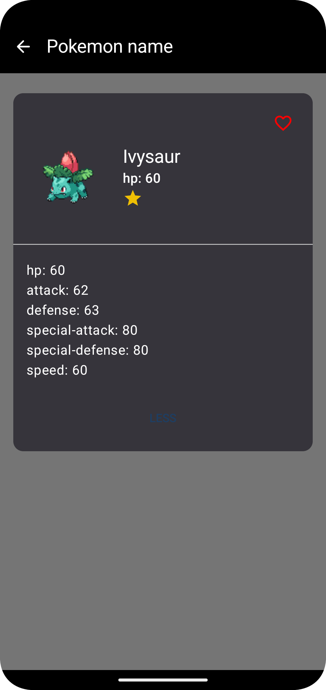

# Pokéverse 🎮

A modern Android application showcasing Pokémon information using the PokéAPI, built with Jetpack
Compose and following clean architecture principles.

## 📱 Screenshots

<div align="center">
  <table>
    <tr>
      <td align="center">
        
        <br />
        Home Screen
      </td>
        <td align="center">
        
        <br />
        Home Screen
      </td>
      <td align="center">
        
        <br />
        Details Screen
      </td>
      <td align="center">
        
        <br />
        Search Screen
      </td>
    </tr>
  </table>
</div>

## ✨ Features

- **Pokemon List**: Browse through a comprehensive list of Pokémon
- **Detailed Information**: View detailed stats, abilities, and characteristics of each Pokémon
- **Search Functionality**: Easy search feature to find specific Pokémon
- **Offline Support**: Access previously viewed Pokémon without internet connection
- **Clean UI**: Modern, intuitive interface built with Jetpack Compose

## 🛠️ Tech Stack

### Development

- **Language**: [Kotlin](https://kotlinlang.org/)
- **Minimum SDK**: 24
- **Target SDK**: 34

### Architecture & Design Patterns

- Clean Architecture
- Repository Pattern
- Dependency Injection with Koin
- Single Activity Pattern
- Kotlin Coroutines & Flow

### Libraries & Dependencies

- **UI Framework**: Jetpack Compose
- **Navigation**: Jetpack Navigation Compose
- **Dependency Injection**: Koin
- **Networking**: Ktor
- **Local Storage**: Room Database
- **Image Loading**: Coil
- **Asynchronous Programming**: Coroutines, Flow
- **Testing**: JUnit5, MockK

## 🏗️ Architecture Overview

The project follows Clean Architecture principles with the following layers:

```
app/
├── data/                  # Data Layer
│   ├── local/            # Local storage (Room DB)
│   │   ├── dao/
│   │   ├── database/
│   │   └── model/
│   ├── remote/           # Remote data source
│   │   ├── api/
│   │   └── model/
│   └── repository/       # Repository implementations
├── di/                   # Dependency injection
│   └── modules/
├── domain/              # Domain Layer
│   ├── model/          # Domain models
│   ├── repository/     # Repository interfaces
│   └── usecase/       # Business logic
└── presentation/      # Presentation Layer
    ├── navigation/   # Navigation handling
    ├── screen/      # UI screens
    ├── theme/      # App theme
    └── viewmodel/  # ViewModels

```

### Data Flow

1. UI Layer (Compose) <-> ViewModel
2. ViewModel <-> Use Cases
3. Use Cases <-> Repositories
4. Repositories <-> Data Sources (API/Local DB)

## 🚀 Getting Started

### Prerequisites

- Android Studio Arctic Fox or later
- JDK 11 or later
- Android SDK with minimum API 24

### Installation

1. Clone the repository

```bash
git clone https://github.com/Cameron-Fisher-DVT/poke_verse.git
```

2. Open project in Android Studio
3. Sync project with Gradle files
4. Run the app on an emulator or physical device

## 🧪 Testing

The project includes:

- Unit Tests
- Integration Tests
- UI Tests using Compose Testing

Run tests using:

```bash
./gradlew test        # Unit tests
./gradlew connectedAndroidTest  # Instrumentation tests
```

## 📝 License

This project is licensed under the MIT License - see the [LICENSE](LICENSE) file for details.

## 🤝 Contributing

1. Fork the Project
2. Create your Feature Branch (`git checkout -b feature/AmazingFeature`)
3. Commit your Changes (`git commit -m 'Add some AmazingFeature'`)
4. Push to the Branch (`git push origin feature/AmazingFeature`)
5. Open a Pull Request
